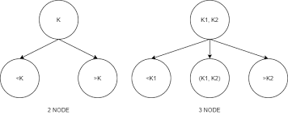
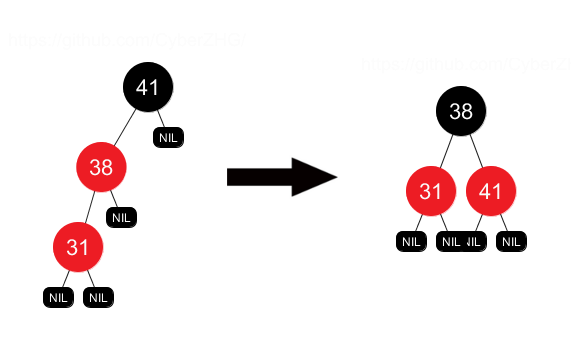

## Árvore 2-3

- Árvore completamente balanceada
- Pode ser vazia
- Nós podem ser de três tipos:
    - **Tipo 2:** filho da esquerda e da direita
    - **Tipo 3:** filho da esquerda, da direita e do meio
    - **Tipo 4:** filho da direita, da esquerda e dois do meio *(tipo temporário)*

- Quando tem o nó do tipo 4, pega o elemento do meio e sobe para o pai, e os dois filhos do meio viram filhos do pai

    

- **Busca:** igual a árvore binária de busca com complexidade `O(log n)`
- **Inserção:** igual a árvore binária de busca, mas quando chega no nó do tipo 4, faz a rotação com complexidade `O(log n)`
- **Remoção:** igual a árvore binária de busca, mas quando chega no nó do tipo 2, faz a rotação

## Árvore LLD Red-Black (Descendente Esquerdista Rubro-Negra)
- É uma implementação da árvore 2-3
- Sempre a esquerda é menor, sempre a direita é maior
- Todo nó inserido é vermelho
- Não pode ter vermelho a direita
- Quando tem dois vermelhos no nó-pai (ou em sequência), é feito a operação `flip-colors`
    - Nó-pai vai pra cima (em vermelho), os filhos viram pretos

    

### Definição do nó

```c
typedef struct node 
{
    Item item;
    node *left, *right;
    bool red;
} node;
```

### Definição de funções

```c
bool is_red(node *x)
{
    return x != NULL && x->red
}
```

```c
void flip_colors(node *root)
{
    root->left->red = false;
    root->right->red = false;
    root->red = true;
}
```

```c
// Acionado quando o filho a direita é vermelho
node *rotate_left(node *root)
{
    node *new_root = r->right;
    root->dir = new_root->left;
    new_root->left = root;
    new_root->red = root->red;
    root->red = true;

    return new_root;
}
```

```c
// Acionado quando o filho da esquerda é vermelho
node *rotate_right(node *root)
{
    // A implementar
}
```

```c
node *new_node_rb(bool red, node *left, node *right, Item item)
{
    node *new_node = malloc(sizeof(node));
    new_node->red = red;
    new_node->left = left;
    new_node->right = right;
    new_node->item = item;

    return new_node;
}
```

```c
node *insert_node(node *root, Item item)
{
    if(root == NULL)
        return new_node_rb(true, NULL, NULL, item);

    if(less(key(item), key(root->item)))
    {
        node->left = insert_node(root->left, item);
    }
    else if(less(key(root->item), key(item)))
    {
        node->right = insert_node(root->right, item);
    }
    else
    {
        root->item = item;
    }

    // A ordem dessas estruturas de decisão é importante!!
    if(!is_red(root->left) && is_red(root->right))
    {
        root = rotate_left(root);
    }
    
    if(is_red(root->left) && is_red(root->left->left))
    {
        root = rotate_right(root);
    }
    
    if(is_red(root->left) && is_red(root->right))
    {
        root = flip_colors(root);
    }

    return root;
}
```